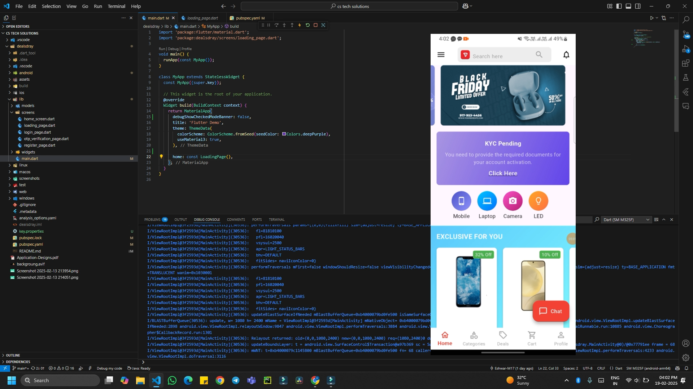
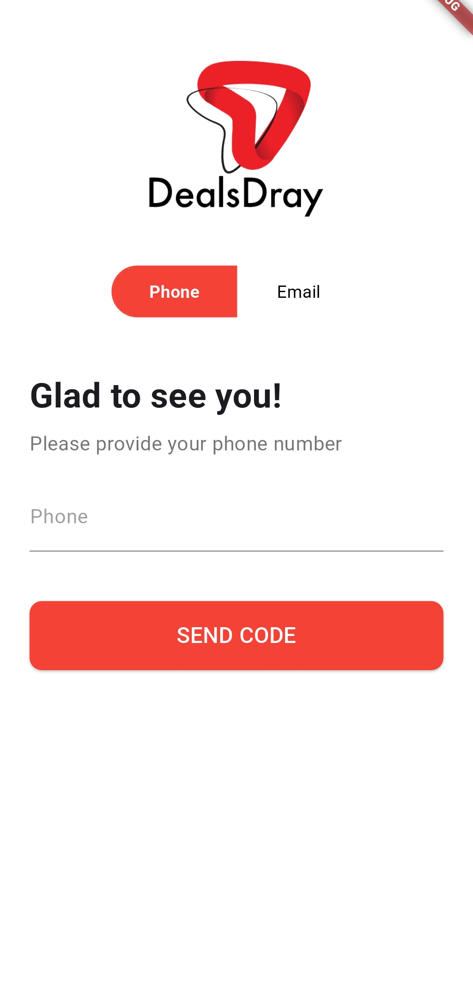
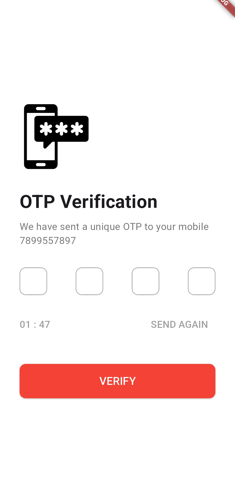
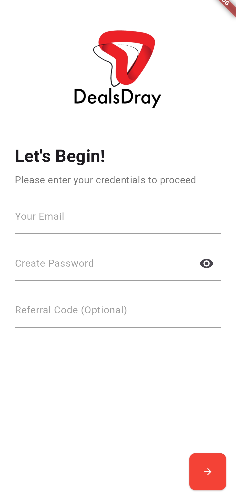

# Flutter App - DealsDray Internship Task

## Overview
This Flutter app is designed as part of the internship selection process for DealsDray. It provides a complete user authentication flow and a rich user interface for product browsing. Key features include:

- **Device Registration**: Registers the device with the server when the app starts.
- **Phone Login & OTP Verification**: Allows users to log in using their phone number and verify via OTP.
- **User Registration**: Collects email, password, and optional referral code for incomplete registrations.
- **Home Screen**: Displays banners, categories, exclusive offers, and a KYC card for account activation.
- **Bottom Navigation Bar**: Provides navigation between Home, Categories, Deals, Cart, and Profile.
- **Floating Action Button**: Initiates a chat feature.

---
### Demo Video

A short demo video (1–3 minutes) has been recorded to showcase the key features of the app,

Download the demo video to watch by clicking the thumbnail below:

<a href="demo_vid">
  
</a> 
## Screenshots
---

<p align="center">
  
  
  
  
</p>


---


## Setup Instructions

### Prerequisites
1. Install Flutter SDK: [Download Flutter](https://flutter.dev/docs/get-started/install).
2. Set up an IDE like Visual Studio Code or Android Studio.
3. Use an emulator or connect a physical device for testing.

### Steps to Run the App
1. **Clone the Repository**
   ```bash
   git clone https://github.com/your-repo-url/flutter-internship-task.git
   cd flutter-internship-task
   ```

2. **Install Dependencies**
   ```bash
   flutter pub get
   ```

3. **Run the App**
   ```bash
   flutter run
   ```

4. **Test on Emulator/Device**
   - Ensure you have an emulator running or a physical device connected.
   - Use the command `flutter devices` to check available devices.

---
